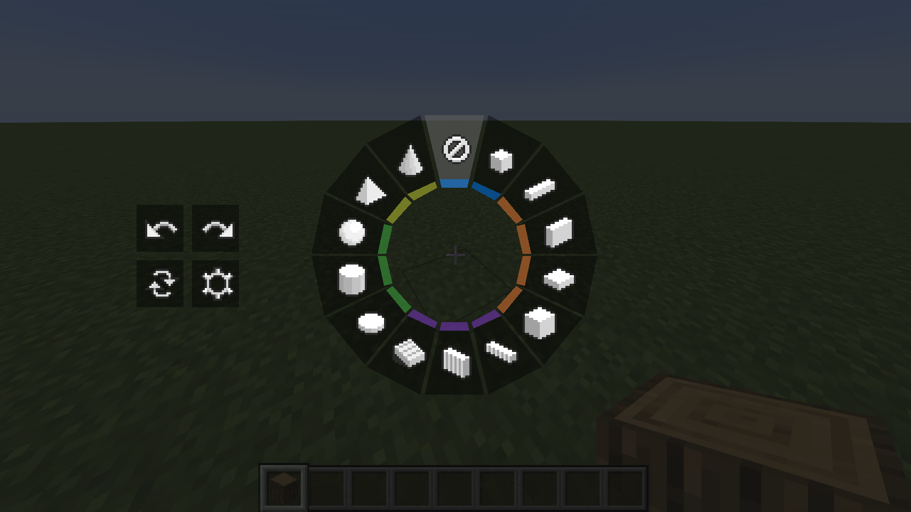
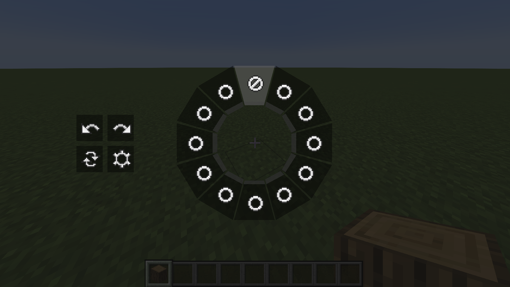
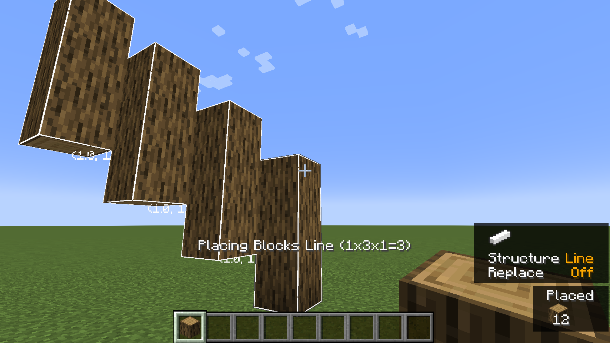
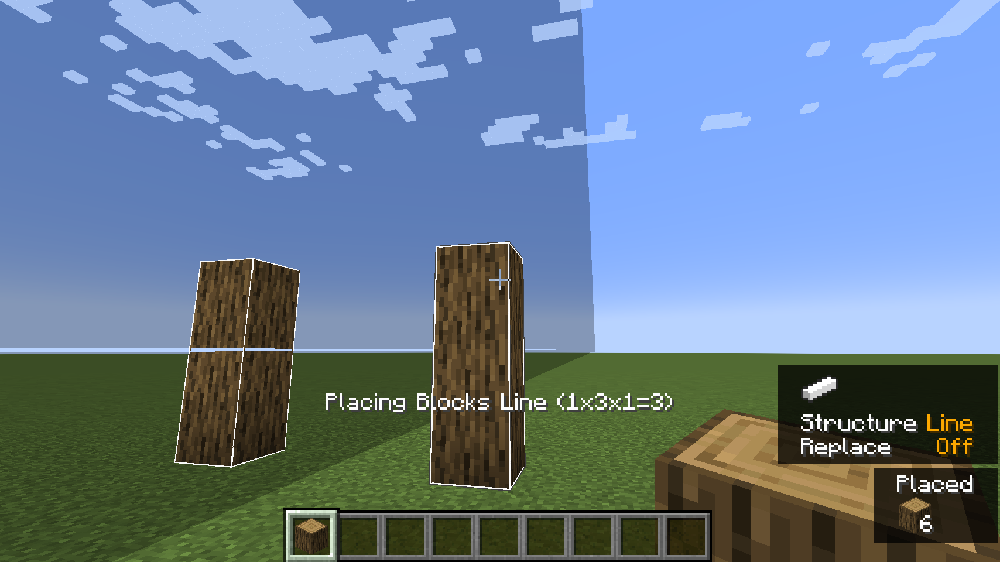
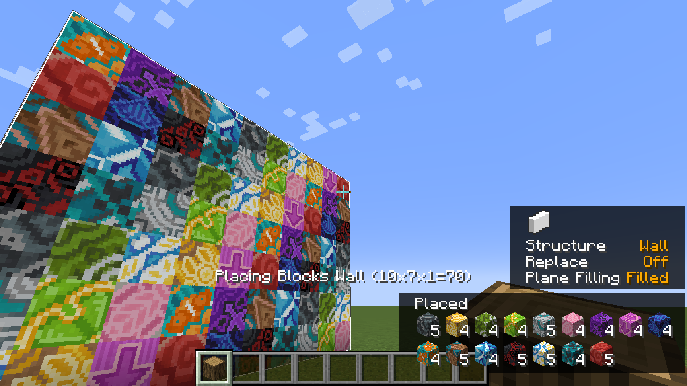

# Effortless Structure

[Effortless Structure]() is a multiplatform mod for placing and breaking blocks in Minecraft. It offers a set of modes allowing
players to create structures and designs with ease. Additionally, it includes an randomizer that randomly selects items
from a pre-defined list for random placement.

    <a href="https://modrinth.com/mod/effortless">Modrinth</a>
     | 
    <a href="https://www.curseforge.com/minecraft/mc-mods/effortless">CurseForge</a>
     | 
    <a href="https://github.com/huskcasaca/effortless">GitHub</a>
     | 
    <a href="https://github.com/huskcasaca/effortless/wiki">Documentation</a>
     | 
    <a href="https://discord.gg/FwbBg8uUZ7">Discord</a>

## Downloads

- [Curseforge](https://www.curseforge.com/minecraft/mc-mods/effortless)
- [Modrinth](https://modrinth.com/mod/effortless)

## Features

- Pure Vanilla Compatibility: The mod is designed to be fully compatible with a pure vanilla game without adding new
  items or making incompatible modifications.
- Randomizer: It includes an item randomizer that lets players place blocks and entities randomly from a pre-defined
  list.

## How to Use

- Hold **LEFT_ALT/LEFT_OPTION** key to open **Build Mode Radial**. You can switch build modes to create different structures. There are buttons for **Undo/Redo**, **General Settings** and **Replace Modes** on the left side.
- Hold **LEFT_WIN/LEFT_COMMAND** key to open  **Build Pattern Radial**. You can switch build patterns to transform the basic structure. If you do not want to create complex structures, just choose **Disable**.

- Click **ATTACK/DESTROY** key to start destroying blocks.
- Click **USE_ITEM/PLACE_BLOCK** key to start placing blocks.

- Click **H** key to open **Settings**. You can change all basic settings of this mod. There are settings for **General Settings**, **Render Settings**, **Pattern Settings** and **Transformer Presets**. You can also hold **LEFT_ALT/LEFT_OPTION** key and click the settings icon to open **Settings**.
- Click **P** key to open **Pattern Settings**. You can edit or delete patterns. You can also create your custom pattern by adding different transformers in it.
- Click **R** key to cycle between **Replace Modes**. You can choose **Disable**, **Normal** or **Quick**.

- Click **LEFT_BRACKET** key to perform **Undo**. You can undo your last build operation.
- Click **RIGHT_BRACKET** key to perform **Redo**. You can redo your last build operation.

### Build Modes
- Build modes are the basic shapes you need to choose when creating a structure. There are currently 13 different types of shapes. Each one has unique features like hollow or filled.

- **Disable**: Place in the vanilla way.
- **Single**: Place with increased reach distance.
- **Line**: Place a line in any of the three axes.
- **Wall**: Place a wall in X or Z axis.
- **Floor**: Place a floor in Y axis.
- **Diagonal Line**: Place a line at any angle.
- **Diagonal Wall**: Place a wall at any angle.
- **Slope Floor**: Place a sloped floor at any angle.
- **Cube**: Place a cube.
- **Circle**: Place a circle shape in any of the three axes.
- **Cylinder**: Place a cylindrical shape in any of the three axes.
- **Sphere**: Place a sphere made of blocks.
- **Pyramid**: Place a pyramid made of blocks.
- **Cone**: Place a cone made of blocks.

### Build Transformers
- Build transformers are part of the build pattern and are used to modify the build structure. You can use a mirror to create a mirrored copy of a wall shape. You can also use an item randomizer to create a wall of random blocks. You can also combine different build transformers to create complex shapes. There are currently 4 types of transformers.

- **Mirror**: Mirrors blocks and entities for even and uneven builds.
- **Array**: Copies blocks and entities in a specific direction for a specified number of times.
- **Radial**: Places blocks and entities in a circular pattern around a central point. The circle can be divided
  into sections, and each section will contain a copy of the block placements.
- **Item Randomizer**: Randomizes the placement of blocks and entities.

### Build Patterns
- Build patterns are containers of build transformers. You can combine different build transformers to create complex shapes.

### Replace Modes

- **Disable**: Does not replace any existing blocks when placing new blocks.
- **Normal**: Replaces existing blocks when placing new blocks, excluding the first block.
- **Quick**: Replaces existing blocks, including the first block, when placing new blocks.

## Screenshots

### Build Modes

### Build Patterns

### Single Array Build Pattern

### Single Mirror Build Pattern

### Single Item Randomizer Build Pattern

## Platforms

Please note that currently, this mod needs to be installed on both the client side and server side.

### Server + Client

| Minecraft                | Fabric | Forge |
| ------------------------ | ------ | ----- |
| 1.20.4 (Server + Client) | ✅     | ✅    |
| 1.20.3 (Server + Client) | ✅     | ✅    |
| 1.20.2 (Server + Client) | ✅     | ✅    |
| 1.20.1 (Server + Client) | ✅     | ✅    |
| 1.20 (Server + Client)   | ✅     | ✅    |
| 1.19.4 (Server + Client) | ✅     | ✅    |
| 1.19.3 (Server + Client) | ✅     | ✅    |
| 1.19.2 (Server + Client) | ✅     | ✅    |
| 1.19.1 (Server + Client) | ✅     | ✅    |
| 1.19 (Server + Client)   | ✅     | ✅    |
| 1.18.2 (Server + Client) | ✅     | ✅    |
| 1.18.1 (Server + Client) | ✅     | ✅    |
| 1.18 (Server + Client)   | ✅     | ✅    |
| 1.17.1 (Server + Client) | ✅     | ✅    |
| 1.17 (Server + Client)   | ❌     | ❌    |

### Server Only

| Minecraft            | Fabric | Forge | Sponge | CLI |
|----------------------|--------|-------|--------|-----|
| 1.20.4 (Server Only) | ❌      | ❌     | ❌      | ❌   |
| 1.20.3 (Server Only) | ❌      | ❌     | ❌      | ❌   |
| 1.20.2 (Server Only) | ❌      | ❌     | ❌      | ❌   |
| 1.20.1 (Server Only) | ❌      | ❌     | ❌      | ❌   |
| 1.20 (Server Only)   | ❌      | ❌     | ❌      | ❌   |
| 1.19.4 (Server Only) | ❌      | ❌     | ❌      | ❌   |
| 1.19.3 (Server Only) | ❌      | ❌     | ❌      | ❌   |
| 1.19.2 (Server Only) | ❌      | ❌     | ❌      | ❌   |
| 1.19.1 (Server Only) | ❌      | ❌     | ❌      | ❌   |
| 1.19 (Server Only)   | ❌      | ❌     | ❌      | ❌   |
| 1.18.2 (Server Only) | ❌      | ❌     | ❌      | ❌   |
| 1.18.1 (Server Only) | ❌      | ❌     | ❌      | ❌   |
| 1.18 (Server Only)   | ❌      | ❌     | ❌      | ❌   |
| 1.17.1 (Server Only) | ❌      | ❌     | ❌      | ❌   |
| 1.17 (Server Only)   | ❌      | ❌     | ❌      | ❌   |

### Client Only (Commands)

| Minecraft            | Fabric | Forge | CLI |
| -------------------- | ------ | ----- | --- |
| 1.20.4 (Client Only) | ✅     | ✅    | ✅  |
| 1.20.3 (Client Only) | ✅     | ✅    | ✅  |
| 1.20.2 (Client Only) | ✅     | ✅    | ✅  |
| 1.20.1 (Client Only) | ✅     | ✅    | ✅  |
| 1.20 (Client Only)   | ✅     | ✅    | ✅  |
| 1.19.4 (Client Only) | ✅     | ✅    | ✅  |
| 1.19.3 (Client Only) | ✅     | ✅    | ✅  |
| 1.19.2 (Client Only) | ✅     | ✅    | ✅  |
| 1.19.1 (Client Only) | ✅     | ✅    | ✅  |
| 1.19 (Client Only)   | ✅     | ✅    | ✅  |
| 1.18.2 (Client Only) | ✅     | ✅    | ✅  |
| 1.18.1 (Client Only) | ✅     | ✅    | ✅  |
| 1.18 (Client Only)   | ✅     | ✅    | ✅  |
| 1.17.1 (Client Only) | ✅     | ✅    | ✅  |
| 1.17 (Client Only)   | ❌     | ❌    | ❌  |

## Dependencies

## Forge

| Dependency   | Download                          |
| ------------ | --------------------------------- |
| Forge Loader | https://files.minecraftforge.net/ |

## Fabric

| Dependency    | Download                                                      |
| ------------- | ------------------------------------------------------------- |
| Fabric Loader | https://fabricmc.net/use/installer/                           |
| Fabric API    | https://www.curseforge.com/minecraft/mc-mods/fabric-api/files |

## Credits

* **[Requioss](https://www.curseforge.com/members/requioss)**, the author
  of [Effortless Building](https://www.curseforge.com/minecraft/mc-mods/effortless-building)
* **[loehnertj](https://github.com/loehnertj)**, for porting to 1.20.2

## License

Effortless Structure is licensed under LGPLv3.
