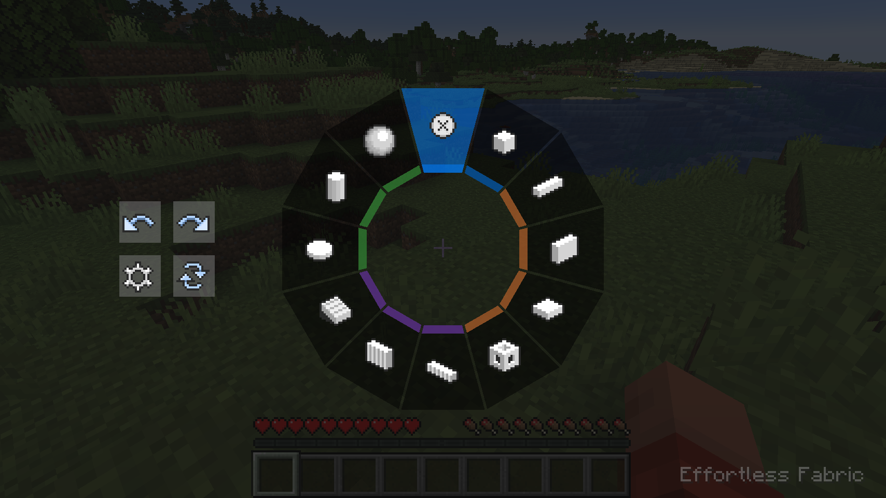
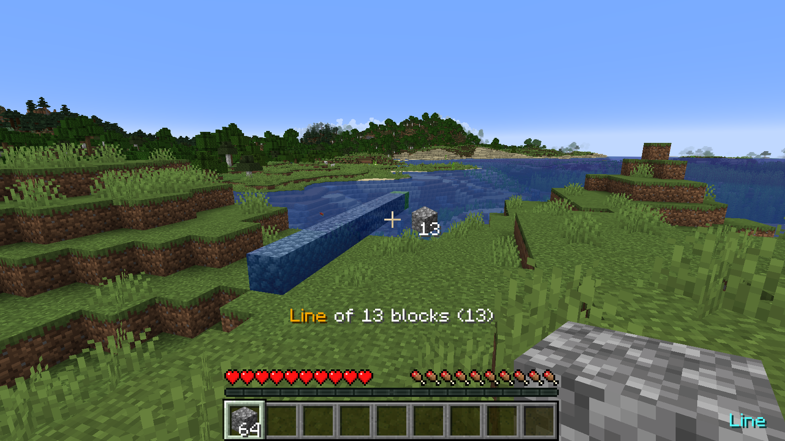
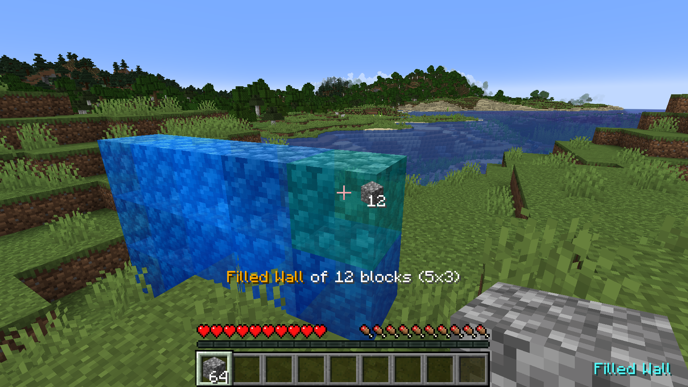
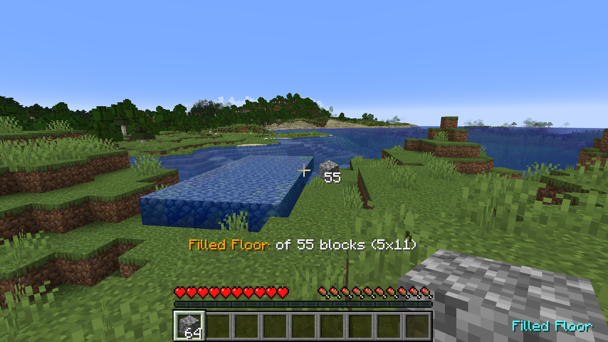
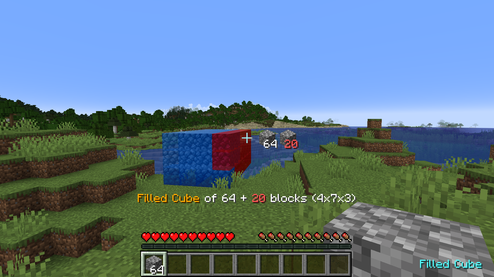

# Effortless

[Effortless]() is a multiplatform mod for placing and breaking blocks in Minecraft. It offers a set of modes allowing
players to create structures and designs with ease. Additionally, it includes an randomizer that randomly selects items
from a pre-defined list for random placement.

    <a href="https://modrinth.com/mod/effortless">Modrinth</a>
     | 
    <a href="https://www.curseforge.com/minecraft/mc-mods/effortless">CurseForge</a>
     | 
    <a href="https://github.com/huskcasaca/effortless">GitHub</a>
     | 
    <a href="https://github.com/huskcasaca/effortless/wiki">Documentation</a>
     | 
    <a href="https://discord.com/invite">Discord</a>

## Platforms

Please note that currently, this mod needs to be installed on both the client side and server side.

### Server + Client

| Minecraft                | Vanilla | Fabric | Forge |
|--------------------------|---------|--------|-------|
| 1.20.4 (Server + Client) | ✅       | ✅      | ✅     |
| 1.20.3 (Server + Client) | ❌       | ❌      | ❌     |
| 1.20.2 (Server + Client) | ✅       | ✅      | ✅     |
| 1.20.1 (Server + Client) | ❌       | ❌      | ❌     |
| 1.20 (Server + Client)   | ❌       | ❌      | ❌     |
| 1.19.4 (Server + Client) | ✅       | ✅      | ✅     |
| 1.19.3 (Server + Client) | ❌       | ❌      | ❌     |
| 1.19.2 (Server + Client) | ✅       | ✅      | ✅     |
| 1.19.1 (Server + Client) | ❌       | ❌      | ❌     |
| 1.19 (Server + Client)   | ❌       | ❌      | ❌     |
| 1.18.2 (Server + Client) | ✅       | ✅      | ✅     |
| 1.18.1 (Server + Client) | ❌       | ❌      | ❌     |
| 1.18 (Server + Client)   | ❌       | ❌      | ❌     |
| 1.17.1 (Server + Client) | ✅       | ✅      | ✅     |
| 1.17 (Server + Client)   | ❌       | ❌      | ❌     |

### Server Only

| Minecraft            | Vanilla | Fabric | Forge | Sponge | CLI |
|----------------------|---------|--------|-------|--------|-----|
| 1.20.4 (Server Only) | ❌       | ❌      | ❌     | ❌      | ❌   |
| 1.20.3 (Server Only) | ❌       | ❌      | ❌     | ❌      | ❌   |
| 1.20.2 (Server Only) | ❌       | ❌      | ❌     | ❌      | ❌   |
| 1.20.1 (Server Only) | ❌       | ❌      | ❌     | ❌      | ❌   |
| 1.20 (Server Only)   | ❌       | ❌      | ❌     | ❌      | ❌   |
| 1.19.4 (Server Only) | ❌       | ❌      | ❌     | ❌      | ❌   |
| 1.19.3 (Server Only) | ❌       | ❌      | ❌     | ❌      | ❌   |
| 1.19.2 (Server Only) | ❌       | ❌      | ❌     | ❌      | ❌   |
| 1.19.1 (Server Only) | ❌       | ❌      | ❌     | ❌      | ❌   |
| 1.19 (Server Only)   | ❌       | ❌      | ❌     | ❌      | ❌   |
| 1.18.2 (Server Only) | ❌       | ❌      | ❌     | ❌      | ❌   |
| 1.18.1 (Server Only) | ❌       | ❌      | ❌     | ❌      | ❌   |
| 1.18 (Server Only)   | ❌       | ❌      | ❌     | ❌      | ❌   |
| 1.17.1 (Server Only) | ❌       | ❌      | ❌     | ❌      | ❌   |
| 1.17 (Server Only)   | ❌       | ❌      | ❌     | ❌      | ❌   |

### Client Only

| Minecraft            | Vanilla | Fabric | Forge | CLI |
|----------------------|---------|--------|-------|-----|
| 1.20.4 (Client Only) | ❌       | ❌      | ❌     | ❌   |
| 1.20.3 (Client Only) | ❌       | ❌      | ❌     | ❌   |
| 1.20.2 (Client Only) | ❌       | ❌      | ❌     | ❌   |
| 1.20.1 (Client Only) | ❌       | ❌      | ❌     | ❌   |
| 1.20 (Client Only)   | ❌       | ❌      | ❌     | ❌   |
| 1.19.4 (Client Only) | ❌       | ❌      | ❌     | ❌   |
| 1.19.3 (Client Only) | ❌       | ❌      | ❌     | ❌   |
| 1.19.2 (Client Only) | ❌       | ❌      | ❌     | ❌   |
| 1.19.1 (Client Only) | ❌       | ❌      | ❌     | ❌   |
| 1.19 (Client Only)   | ❌       | ❌      | ❌     | ❌   |
| 1.18.2 (Client Only) | ❌       | ❌      | ❌     | ❌   |
| 1.18.1 (Client Only) | ❌       | ❌      | ❌     | ❌   |
| 1.18 (Client Only)   | ❌       | ❌      | ❌     | ❌   |
| 1.17.1 (Client Only) | ❌       | ❌      | ❌     | ❌   |
| 1.17 (Client Only)   | ❌       | ❌      | ❌     | ❌   |

## Dependencies

## Forge

| Dependency   | Download                          |
|--------------|-----------------------------------|
| Forge Loader | https://files.minecraftforge.net/ |

## Fabric

| Dependency    | Download                                                      |
|---------------|---------------------------------------------------------------|
| Fabric Loader | https://fabricmc.net/use/installer/                           |
| Fabric API    | https://www.curseforge.com/minecraft/mc-mods/fabric-api/files |

## Downloads

- [Curseforge](https://www.curseforge.com/minecraft/mc-mods/effortless)
- [Modrinth](https://modrinth.com/mod/effortless)

## Features

- Pure Vanilla Compatibility: The mod is designed to be fully compatible with a pure vanilla game without adding new
  items or making incompatible modifications.
- Building Commands: It provides a set of commands specifically designed for building, which are available to players on
  the server side only.
- Randomizer: It includes an item randomizer that lets players place blocks and entities randomly from a pre-defined
  list.
- Magnet: It has a magnet option that allows players to pick up items far away from them.

## Building

Hold ALT key to switch build modes in the radial panel. There are buttons for undo/redo, transformer settings and
replace modes on the left. The options for each build mode (like a filled vs hollow wall) are on the right.

### Build Modes

- **Disable**: Place in the vanilla way.
- **Single**: Place with increased reach distance.
- **Line**: Place a line in any of the three axes.
- **Wall**: Place a wall in X or Z axis.
- **Floor**: Place a floor in Y axis.
- **Diagonal Line**: Place a line at any angle.
- **Diagonal Wall**: Place a wall at any angle.
- **Slope Floor**: Place a sloped floor at any angle.
- **Cube**: Place a cube.
- **Circle**: Place a circle shape in any of the three axes.
- **Cylinder**: Place a cylindrical shape in any of the three axes.
- **Sphere**: Place a sphere made of blocks.

### Build Transformers

- **Mirror**: Mirrors blocks and entities for even and uneven builds.
- **Array**: Copies blocks and entities in a specific direction for a specified number of times.
- **Radial Mirror**: Places blocks and entities in a circular pattern around a central point. The circle can be divided
  into sections, and each section will contain a copy of the block placements.

### Replace Modes

- **Disable**: Does not replace any existing blocks when placing new blocks.
- **Normal**: Replaces existing blocks when placing new blocks, excluding the first block.
- **Quick**: Replaces existing blocks, including the first block, when placing new blocks.

## Screenshots

### Building Menu

### Line Mode

### Filled Wall Mode

### Filled Floor Mode

### Filled Cube Mode

## Changelog

### 2.0.0

* Add support for Forge.
* Add item randomizer
* Rewrite everything

### 1.6.3

* Fix action bar text covering issue
* Fix image resource path converting issue

### 1.6.2

* Fix block breaking issue on server side

### 1.6.1

* Fix compatability with Gravity API

### 1.6.0

* Add build orientation option for circle modes
* Add block count indicator
* Add preview for insufficient block
* Add build commands
* Fix array and mirror block duplication issue
* Fix block breaking issue in survival mode

### 1.5.3

* Fix compatibility with OptiFine
* Fix transformer settings duplicate items

### 1.5.2

* Fix insufficient block placing crash issue in survival mod

### 1.5.1

* Fix undo/redo in creative mode with no matching item in inventory

### 1.5.0

* Add build info in gui
* Rearrange transformer settings entries
* Fix block preview issue in place with large coordinates

### 1.4.2

* Fix network packet issue

### 1.4.1

* Fix player dimension change issue

### 1.4.0

* Add vanilla keybindings
* Build transformer settings is no longer save to player data
* Fix some mixin missing issue on server side
* Fix contact info in mod description file

### 1.3.0

* Rearrange radial menu buttons
* Fix wall items placing issue
* Fix no hitbox item breaking issue

### 1.2.1

* Add message when closing radial menu
* Fix player attach action
* Fix new player settings issue

### 1.2.0

* Fix magnet texture issue
* Fix transformer settings

### 1.1.1

* Add cloth config and modmenu
* Fix access widener issue

### 1.1.0

* Add item magnet

### 1.0.1

* Fix left ctrl not working

### 1.0.0

* Initial release

## Credits

* **[Requioss](https://www.curseforge.com/members/requioss)**, the author
  of [Effortless Building](https://www.curseforge.com/minecraft/mc-mods/effortless-building)
* **[loehnertj](https://github.com/loehnertj)**, for porting to 1.20.2

## License

Effortless is licensed under LGPLv3.
